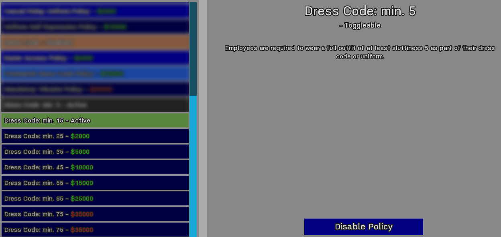
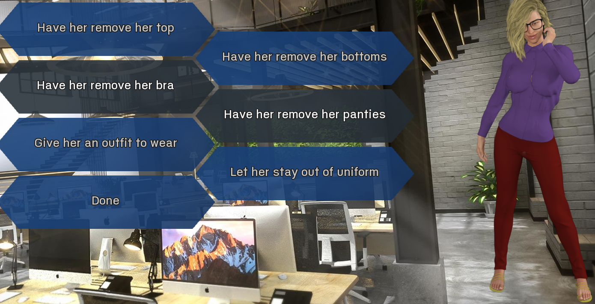

# Dress Code Policy - Minimum Sluttiness

## Installation

Put the .rpy files somewhere in your Mods folder.

## Issues

- Most of the testing was done with personal outfits, not with uniforms. While uniforms should work, it is up to you to ensure that uniforms following your dress code policy are made available. When no appropriate uniforms are available, the employee will still claim that they don't own any allowed outfits and a random outfit will be added to the employee's wardrobe, not into the pool of uniforms.
- While the basic functionality is there, the interactions, dialogue, and personality effects (obedience, happiness, ...) still need a lot of fleshing out. Some parts are taken more or less directly from the uniform disobedience events, other parts are missing entirely, i.e., you have no dialogue, no effects, things just happen.
- While today's (March 24, 2023) updates to this mod vastly improve the way employees pick their outfits (the existing functions for picking outfits were not really set up for a hard minimum sluttiness score), currently only the sluttiness score is being evaluated, other preferences (e.g., favorite colors, "hates showing butt") are not taken into consideration.
- When an employee does not own any allowed outfits and MC tells them to "buy an appropriate outfit after work", a randomly generated (and then personalized) outfit is immediately added to their wardrobe. The outfit is generated with existing functions and is a bit hit and miss. Some outfits are still not allowed, others have a *way* higher score than necessary or accepted by the employee.

## Description

Adds a couple of dress code policies that add a minimum sluttiness requirement to the employees' outfits. Includes disobedience events along the lines of the existing uniform events.  

The regular dress code policy is a requirement for the minimum sluttiness policies However, you may want to disable the regular dress code policy when using these policies to avoid ending up with a too narrow range of allowed outfits (i.e. lower limit 35, upper limit 40) where employees are pretty much guaranteed to be unable to find an acceptable outfit.

### Disobedience Events

When the employee has an appropriate outfit, but decides not to wear it, you'll get the existing options from the uniform disobedience events. However, if they could not find / assemble an appropriate outfit you'll see some new options to deal with the situation.  
