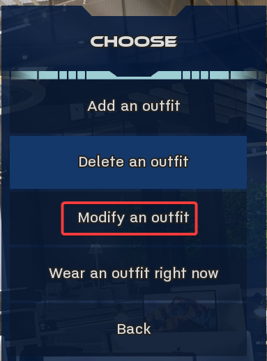

# Modify Outfit

## Installation

Put the .rpy files somewhere in your Mods folder.

## Description

Adds an option to modify a person's existing outfits to the "Change your wardrobe" command.

- Give her a command  

- Change your wardrobe  

- Modify an outfit  
