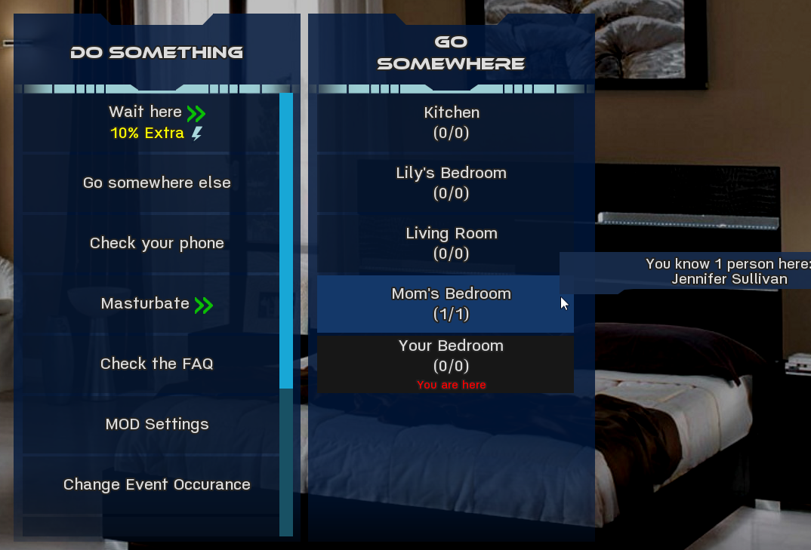
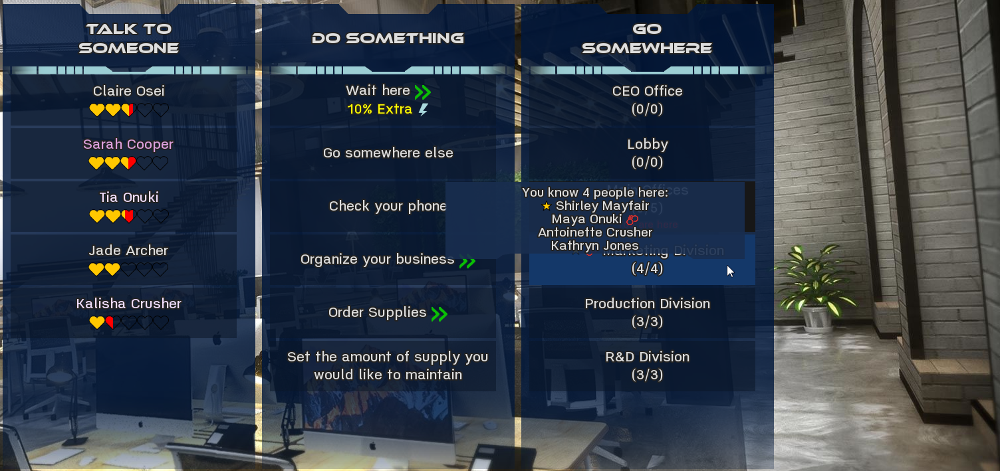

# Nearby Locations


## Warning

This is a dirty edit to the main script file since it has to modify the `game_loop` label. Therefore, it is easily outdated and likely to break something the moment the main game / bugfix / expansion mod gets an update.

I would suggest to only use this as a reference when manually editing `script.rpy` after updating the game.


## Dependencies

- Silence Map


## Installation

Replace or modify `script.rpy` in the `game` directory.

To manually modify the rpy file:

- add the function `LENA_nearby_location_enabled`
- add the function `LENA_sort_location_list`
- add the function `LENA_build_nearby_location_list`
- add the label `LENA_change_location`
- in the label `game_loop` in one of the first lines, add `LENA_build_nearby_location_list()` to the call to `enhanced_main_choice_display`:  
```
if mod_installed:
    call screen enhanced_main_choice_display(build_menu_items([build_people_list(), build_actions_list(), LENA_build_nearby_location_list()]))
```


## Description

Adds a list of nearby locations (same district / building on the new map) to the action menu.  
  
  