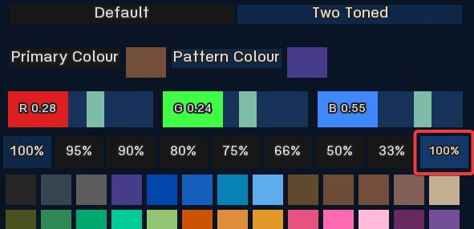
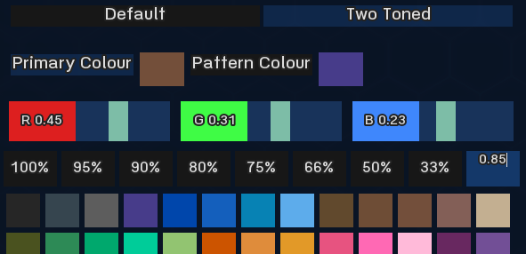

# Type Any Transparency

## Installation

Put the .rpy files somewhere in your Mods folder.

## Description

Allows to type in any transparency (opacity) value for clothing items by clicking on the current value (to the right of the given opacity options).

- Click on the box showing the currently applied alpha value.  

- Enter any value you would like to see.  
